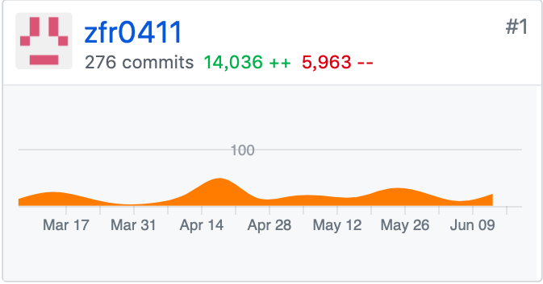
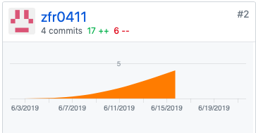
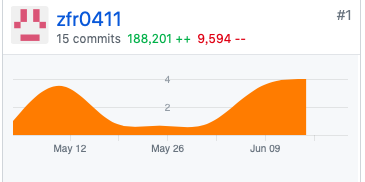
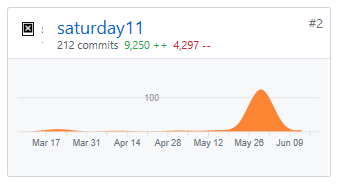
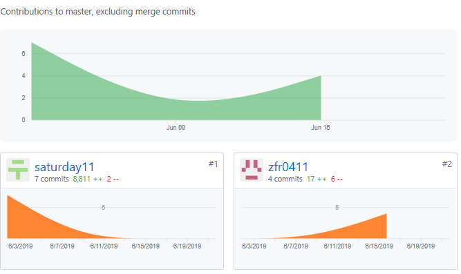

## 团队成员自我总结
`16341023 @zfr0411`
在本次项目中，我主要负责项目的后端部分，以及项目服务器的搭建。在这次项目中，我尝试去使用很多新的东西，例如使用Docker容器部署、Flask集成富文本编辑器等，在项目中个人编码水平有了一定的突破。在完成这个项目时，我们不仅仅要考虑到如何合理地分析设计，更要书写高质量的代码，给读者高可阅读性。
总之，在本次课程的学习中，我的收获还是很大的。
### PSP-2.1 统计表
`16341023 @zfr0411`

|PSP阶段|耗时|
|-|-|
|计划|16|
|.估计任务时间|5|
|开发|136|
|.需求分析|12|
|.生成设计文档|21|
|.设计复审|1
|.代码规范|1
|.具体设计|4
|.代码复审|0
|.测试|13
|报告|2
|测试报告|2
|计算工作量|0
|总结，提出改进计划|1
|**合计**|145

GIT统计报告

                               分工与贡献率
|学号|姓名|分工|贡献率|
|-|-|-|-|
|16341023|周芙蓉|项目管理、后端设计、测试、服务器部署|40%|

* 16341023 @zfr0411

 

`16341003 @Saturday11`
本次项目难度较大，在组长的帮助下进行了UI的美化，在软件测试方面也不是特别了解，每次的会议中听取小组内其他的成员进行更改，项目中遇到了很多问题，在自己无法解决的情况下都还请教了他人。希望下一次能够做的比这一次好。

|PSP阶段|耗时|
|-|-|
|计划|5|
|开发|40|
|.需求分析|5|
|.生成设计文档|2|
|.代码规范|1
|.具体设计|4
|.测试|10
|报告|1
|总结，提出改进计划|1
|**合计**|69

GIT统计报告

                               分工与贡献率
|学号|姓名|分工|贡献率|
|-|-|-|-|
|16341003|陈大朋|UI、软件测试、调研|15%|

* 特别致谢
 * 特别感谢组长，在这个项目中很多BUG在自己解决不了是都是组长帮忙解决
 * 感谢小组所有成员，大家一起努力完成了这个项目。
 * 感谢@jiayuhe等在这次项目给予帮助的人。

