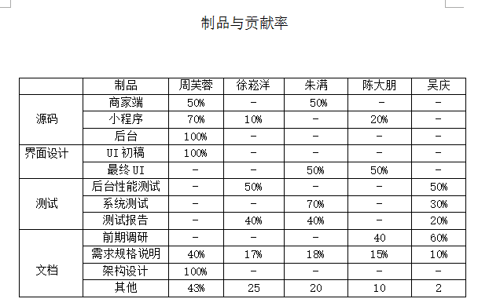
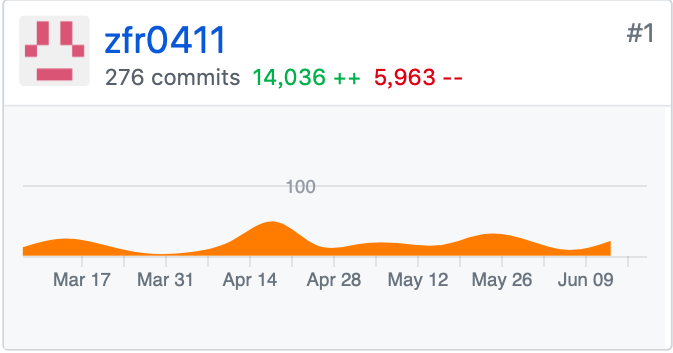
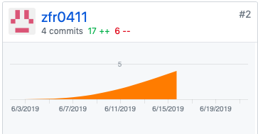
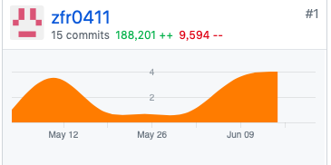
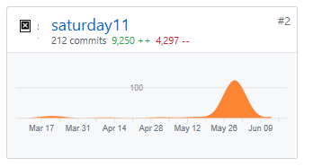
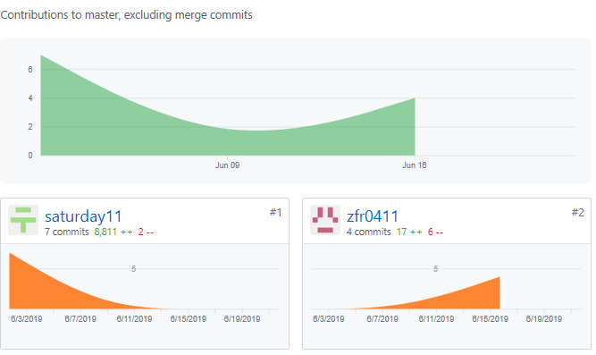
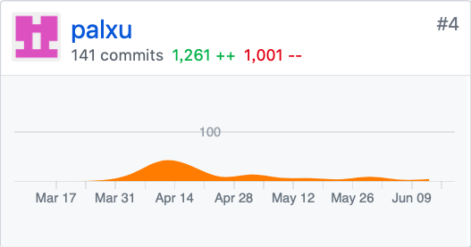

## 小组分工

| 学号   | 姓名   | 角色   | 
|:----|:----|:----|
| 16341023   | zfr0411   | 系统架构师、js工程师、产品经理   | 
| 16341003   | saturday11   | 软件测试   | 
| 16341020   | palxu   |  产品经理，数据库DBA  | 
| 16341019   | wuqing16341019   | 产品特性、设计   | 
| 16341025   | wcptbtptpbcptdtptp   | 系统测试、UI设计、文档规范   | 

## 团队成员自我总结

> `16341023 @zfr0411`
> 在本次项目中，我主要负责项目的后端部分，以及项目服务器的搭建。在这次项目中，我尝试去使用很多新的东西，例如使用Docker容器部署、Flask集成富文本编辑> 器等，在项目中个人编码水平有了一定的突破。在完成这个项目时，我们不仅仅要考虑到如何合理地分析设计，更要书写高质量的代码，给读者高可阅读性。

> 总之，在本次课程的学习中，我的收获还是很大的。

### PSP-2.1 统计表
`16341023 @zfr0411`

|PSP阶段|耗时|
|-|-|
|计划|16|
|.估计任务时间|5|
|开发|136|
|.需求分析|12|
|.生成设计文档|21|
|.设计复审|1
|.代码规范|1
|.具体设计|4
|.代码复审|0
|.测试|13
|报告|2
|测试报告|2
|计算工作量|0
|总结，提出改进计划|1
|**合计**|145

GIT统计报告
分工与贡献率 

|学号|姓名|分工|贡献率|
|-|-|-|-|
|16341023|周芙蓉|项目管理、后端设计、测试、服务器部署|40%|

* 16341023 @zfr0411

 

`16341003 @Saturday11`
> 本次项目难度较大，在组长的帮助下进行了UI的美化，在软件测试方面也不是特别了解，每次的会议中听取小组内其他的成员进行更改，项目中遇到了很多问题，在自> 己无法解决的情况下都还请教了他人。希望下一次能够做的比这一次好。

|PSP阶段|耗时|
|-|-|
|计划|5|
|开发|40|
|.需求分析|5|
|.生成设计文档|2|
|.代码规范|1
|.具体设计|4
|.测试|10
|报告|1
|总结，提出改进计划|1
|**合计**|69

GIT统计报告

                               分工与贡献率
|学号|姓名|分工|贡献率|
|-|-|-|-|
|16341003|陈大朋|UI、软件测试、调研|15%|

* 16341003 @saturday11

* 特别致谢
   *  特别感谢组长，在这个项目中很多BUG在自己解决不了是都是组长帮忙解决
   *  感谢小组所有成员，大家一起努力完成了这个项目。
   *  感谢@jiayuhe等在这次项目给予帮助的人。
   
   
   
`16341019 @wuqing16341019`
> 自我总结：本次项目难度很大，前期都没入门，全靠组员特别是组长的带领，帮助才慢慢的开始理解github相关使用方法，组长分配任务很智慧，各尽其能，即使是最菜的我也有
>很大收获，这是第一次自己投入一个项目中去，虽然完成得不够好，但是组员们都乐意为我提出建议并给予帮助，真的非常感谢他们,如果还有机会，我愿意继续做这
>种项目,提升自己，感谢老师给我们进步的机会！

|PSP阶段|耗时|
|-|-|
|计划|3|
|开发|18|
|.需求分析|5|
|.生成设计文档|2|
|.代码规范|12
|.具体设计|18
|.测试|15
|报告|1
|总结，提出改进计划|1
|**合计**|75

GTT统计报告

                               分工与贡献率
|学号|姓名|分工|贡献率|
|-|-|-|-|
|16341019|吴庆|项目前期调研、产品特性、后台及性能测试|13%|
* 16341019 @wuqing16341019

`16341020 @palxu`
> 自我总结：通过这次项目，基本的了解了整个该有的流程，但是由于自己代码编写能力不强，所以大部分都在编写文档以及策划

> 很大收获：了解到了项目经理应该需要的能力以及在整个项目的规划上需要下的功夫，将课程所学真正的运用到实践当中，完成了第一个正式的项目。

|PSP阶段|耗时|
|-|-|
|计划|5|
|开发|20|
|.需求分析|15|
|.生成设计文档|20|
|.代码规范|1
|.具体设计|4
|.测试|10
|报告|1
|总结，提出改进计划|1
|**合计**|93

GIT统计报告

                               分工与贡献率
|学号|姓名|分工|贡献率|
|-|-|-|-|
|16341020|徐崧洋|项目规划、产品特性、用例图、领域模型|15%|
* 16341020 @palxu

