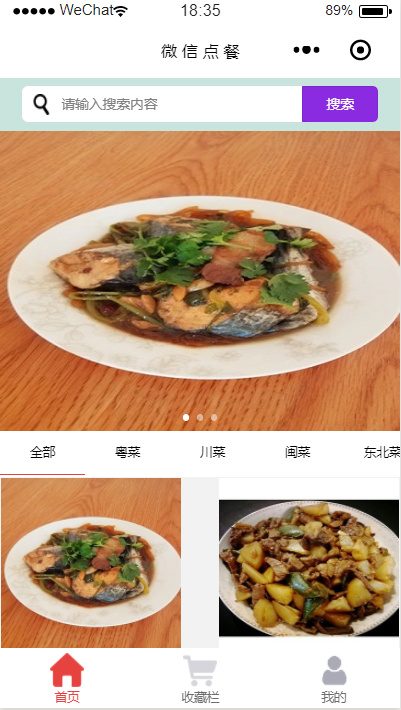
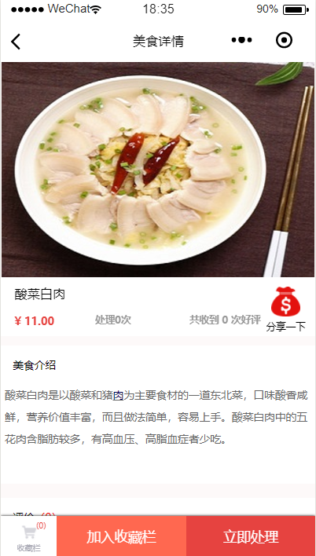
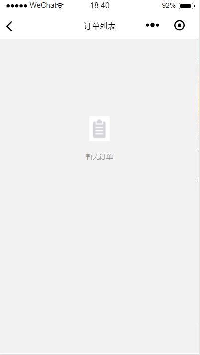
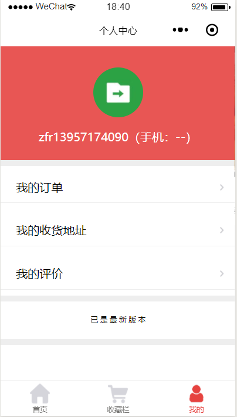
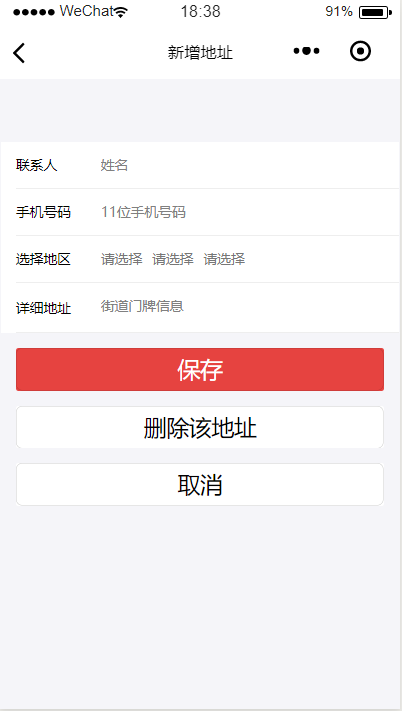
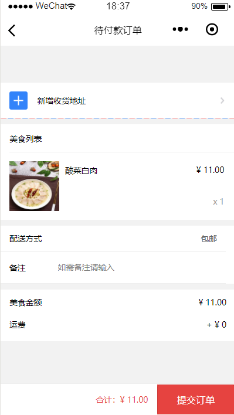

# UI设计
{:.no_toc}
* * *
* 目录
{:toc}

## 菜单
* * *
> ### 菜单概览

- - -
> ### 购物车列表

- - -
> ### 菜品添加

- - -
## 菜品搜索

> ### 完整搜索

* * *
## 菜品详情

- - -
## 订单确认

> ### 订单列表

_ _ _
> ### 个人中心

_ _ _
> ### 新增地址

_ _ _
> ### 选择顾客人数

_ _ _
## 提交订单

