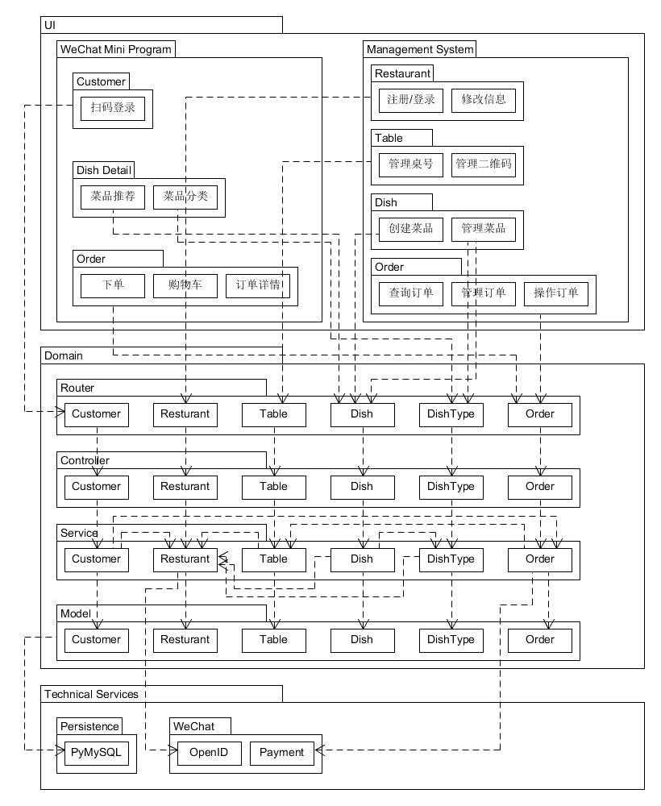

# Software Architecture Document
{:.no_toc}

* 目录
{: toc}

## 架构问题

### 可靠性和可恢复性

* 因素：小程序使用过程中出现访问服务端中断问题并进行恢复
* 度量和质量场景：当小程序访问服务端中断时，在正常的工作环境下，如果在15s内检测到其恢复，则重新建立连接
* 可变性：在能够重新建立连接之前，可以在客户端进行简化服务
* 该因素对涉众、架构以及其他因素的影响 ：小程序使用者的访问数据可能会发生丢失，无法传递给服务端
* 对于成功的优先级 ：高
* 困难或风险：中等

### 可支持性和可适用性

* 因素：支持多种可变的第三方服务（支付系统等）
* 度量和质量场景：当小程序访问第三方系统时可正常建立连接
* 可变性：对于不同的第三方服务需要可连接的接口
* 该因素对涉众、架构以及其他因素的影响 ：提高小程序的可扩展性
* 对于成功的优先级 ：中等
* 困难或风险：中等

## 解决方案说明

### 如何提高服务器性能

* 增加服务器内存
* 限制同时服务的最多用户数，避免服务器负载超荷
* 将动态数据存储到缓存文件中，前端（小程序）直接调用这些文件，而不必再访问数据库
  * 比如多人点餐中每个人的购物车可以存在session中，提交订单前的购物车不需存入数据库，该桌提交订单时再把订单记录写入数据库
* 优化数据库的查询SQL，避免使用代价高昂的查询，每次查询只返回自己需要的结果；避免短时间内的大量SQL查询
* 数据库适当建立索引
* 数据库定期备份，当数据库出现操作失误或系统故障导致数据丢失时可以恢复数据

## 逻辑视图

## 物理视图

