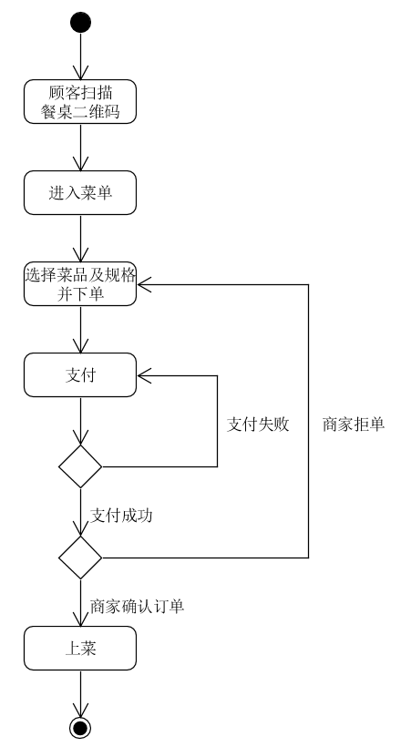

## Usecase design
- - -
### 顾客登录用例设计
{:.no_toc}

* 目录
{：toc}

> #### ***顾客登录用例图***

* * *

> #### ***顾客登录时序图***

- - -

> #### ***类图***

_ _ _

### 顾客点餐下单用例设计

> #### ***顾客点餐下单用例图***

* * *

> #### ***顾客点餐下单时序图***

- - -

> #### ***类图***

_ _ _
