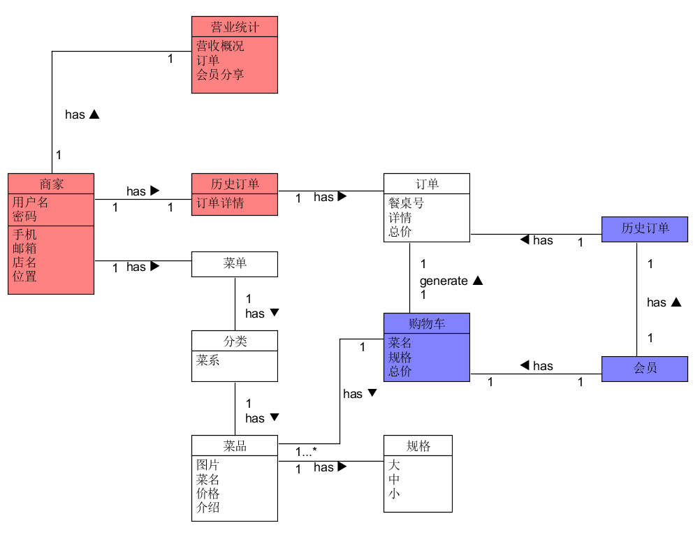

### 领域模型是对领域内的概念类或现实世界中对象的可视化表示。又称概念模型、领域对象模型、分析对象模型。它专注于分析问题领域本身，发掘重要的业务领域概念，并建立业务领域概念之间的关系。
> 业务对象模型（也叫领域模型 domain model）是描述业务用例实现的对象模型。它是对业务角色和业务实体之间应该如何联系和协作以执行业务的一种抽象。业务对象模型从业务角色内部的观点定义了业务用例。该模型为产生预期效果确定了业务人员以及他们处理和使用的对象（“业务类和对象”）之间应该具有的静态和动态关系。它注重业务中承担的角色及其当前职责。这些模型类的对象组合在一起可以执行所有的业务用例

