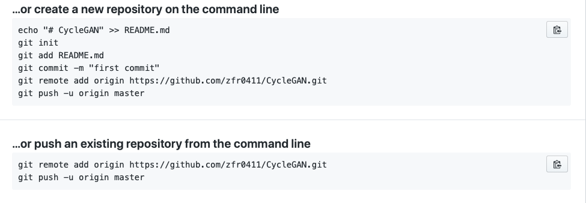
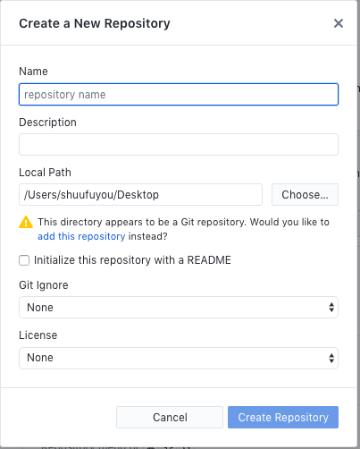

# Github 使用经验分享
作为一个代码管理网站，github使用十分便利，但作为计算机学院大三的学生，到现在不会使用github的还有很多，不会使用谷歌、百度的仍有很多。在我们小组我亲眼见证了他们的神操作，下面由我来分享一下个人使用github的心得，希望我的小组有些成员能抽出一把游戏的时间来查考一下。
## git
git可以说是世界上最先进的版本控制系统，大多语句执行为linux语句。
* 从开发者角度看
  * 在单机上创建分支提交代码
  * 在单机上合并分支
  * 从服务器clone完整的Git仓库到单件上
  * 生成补丁发送给主开发者
* 优点
  * 适合分布式开发
  * 公共服务器压力和数量都不会太大
  * 速度快、灵活
  * 任意两个开发者之间可以何容易的解决冲突
  * 离线工作
### 一、安装
下载地址：https://git-scm.com
### 二、使用
1.进入到git bash（命令行工具）

2.初始化
* git config --global user.name "你的GitHub账户名"
* git config --global user.email "你的GitHub邮箱"

3.开发
在进行创建项目时，不选择自动生成代码，github会给提示如何使用git提交，但似乎我们小组有些成员从来不关系这些，更不会使用搜索引擎，只会说一句 `我不会`.

4.克隆远程仓库
之间使用 git clone 命令
## gitHub Desktop
这里在介绍一种更简单的方法，下载使用Github Desktop
### 一、下载与安装
下载地址：https://desktop.github.com ，网页会根据当前计算机的系统推荐对应的版本。下载安装完成后需要安装git，git用于对项目的管理和维护。git下载与安装方法在上文中已经给出
### 二、配置
* 配置过程MAC：Github Desktop->Preference->Advanced，选取editor，点击save保存。
* 配置过程Windows：File->Options->Advanced，选取editor，点击save保存
### 三、使用
#### 1、Create new Repository
创建一个新的Repository，改Repository当前仅存在于本地。
操作指南：file->new repository

#### 2、Clone a Repository
克隆github上的repository
操作指南：file->clone repository
#### 3、push repository
点击右上角的publish即可
## VSCode
VSCode是一款轻量级代码编辑器，免费功能强大，自带很多功能，例如代码格式化、代码智能提示补全、Emmet插件等。VSCode编写的MD文件完全符合github的设计需求。
* 1、使用VSCode打开项目或代码的仓库
* 2、使用VSCode编写项目
* 3、快捷键
  * 1. 在当前行中间换行到下一行：ctrl+enter 
  * 2. 当光标点击到某一行时，默认选中全行，可以直接复制剪切 
  * 3. 直接删除某一行：shift+delete或者ctrl+shift+k 
  * 4. 多行光标选择：alt+鼠标左键 
  * 5. 自动生成html结构和meta声明：首先输入“!”，然后按tab键 
  * 6. 标签自动补全：tab键 
  * 7. 折叠所有代码：ctrl+k、ctrl+0 
  * 8. 拆分编辑器：ctrl+\ 
  * 9. 跳转行号：ctrl+G 
  * 10. 添加函数注释：在函数上方输入“/**”，然后点击enter 
  * 11. 格式化：alt+shift+f 
  * 12. 注释：ctrl+/ 
  * 13. 全部保存：ctrl+k, 然后只按s一个键 
  * 14. 向上移动一行：alt+↑ 
  * 15. 向下移动一行：alt+↓ 
  * 16. 向上复制一行：alt+shift+↑ 
  * 17. 向下复制一行：alt+shift+↓ 
  * 18. 查找：ctrl+F 
  * 19. 替换：ctrl+H 
  * 20. 文件中查找：ctrl+shift+f 
  可以在打开的文件夹中搜索所有文件内容 
  * 21. 文件中替换：ctrl+shift+h 
  * 22. 转到定义：F12 
  * 23. 转到实现：ctrl+F12 
  * 24. 打开文件夹：ctrl+k, ctrl+o 
  * 25. 关闭文件夹：ctrl+k, 然后单按一个f 
  * 26. 选中一段代码，通过“ctrl+[”可以左移，“ctrl+]”可以右移

