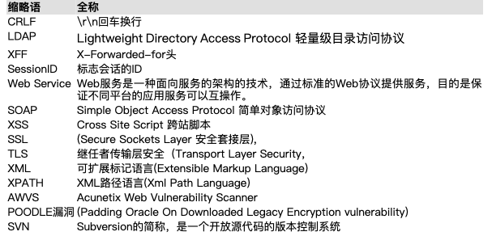

# 1、Web安全漏洞监测与修复

## 1.1、认证和授权

### 1.1.1密码明文传输

* 漏洞名称：密码明文传输
* 漏洞描述：密码明文传输一般存在与web网站登录页面，用户名或密码（一般为密码）使用明文传输，容易被嗅探软件截取。
* 检测条件：web网站有登录界面
* 检测方法：1、找到网站或web登录页面。2、通过使用wireshark等软件对web登录页面进行抓包，分析其数据包中相关passward（密码）的参数值是否为明文。
* 修复方案：使用加密算法传输密码。

### 1.1.2用户名可枚举

* 漏洞名称：用户名可枚举
* 漏洞描述：存在与登录页面中，利用登录时输入系统存在的用户名错误的密码和不存在的用户名错误密码，系统返回不同的错误信息，如果web设计人员为设置多次登录锁定攻击者可以枚举出系统存在的账号信息。
* 检测条件：1、web网站有登录界面。2、登录错误显示不一致
* 检测方法：1、找到网站或web登录页面。2、错误测试，第一次输入错误的用户名和密码，第二次输入正确的用户名错误的密码，观察显示是否一致
* 修复方案：使用一致的错误显示：用户名或密码错误

### 1.1.3暴力攻击

* 漏洞名称：暴力攻击
* 漏洞描述：常常存在于网站的登录系统中，通过对已知的管理员用户名，进行对其登录口令的大量尝试。
* 检测条件：1、web网站有登录界面。2、登录页面无验证码，无锁定机制
* 检测方法：1、找到网站或web登录页面。2、利用burp对登录页面进行抓包，将其发送到Intruder,并设置其密码参数，如pwd=为变量，添加payload（字典），进行攻击，攻击过程中查看其返回的字节长度，来判断是否成功
* 修复方案：封锁多次登录的IP地址

### 1.1.4未授权访问

* 漏洞名称：未授权访问
* 漏洞描述：攻击者没有获取到登录权限或未授权的情况下，或者不需要输入密码，即可通过直接输入网站控制台主页面地址。
* 检测条件：1、web网站有登录界面。2、不用登录，可通过链接直接访问用户页面功能
* 检测方法：1、找到网站或web登录页面。2、爬虫得到相关地址链接，进行直接访问，如果未进行跳转到登录页面，则可判断为存在未授权访问漏洞。
* 修复方案：在系统中，加入用户身份认证机制或者tonken验证，防止可被直接通过连接就可访问到用户的功能进行操作

### 1.1.5越权访问

* 漏洞名称：越权访问
* 漏洞描述：应用在检查授权（Authorization）时存在纰漏，使得攻击者在获得低权限用户帐后后，可以利用一些方式绕过权限检查，访问或者操作到原本无权访问的高权限功能
* 检测条件：1、Web业务存在不同级别的权限（角色）。2、可通过用户名登录网站内进行功能的操作。3、Web业务正常运行
* 检测方法：1、以超管 admin（高权限用户） 身份登录系统，找到一个只有超管（高权限）才有的功能的链接。2、以普通用户登陆进系统，在地址栏输入链接，查看是否能获得该权限。
* 修复方案：对用户操作进行权限校验，防止通过修改参数进入未授权页面及进行非法操作，在服务端对请求的数据和当前用户身份做一个校验检查。

### 1.1.6并发漏洞

* 漏洞名称：并发漏洞
* 漏洞描述：攻击者通过并发http/tcp请求而达到次获奖、多次收获、多次获赠等非正常逻辑所能触发的效果。
* 检测条件：1、Web业务运行正常。2、Web业务存在逻辑上的并发漏洞。
* 检测方法：发送并发http/tcp请求，查看并发前后CGI 功能是否正常。
* 修复方案：对数据库操作加锁

### 1.1.6SQL注入

* 漏洞名称：SQL注入
* 漏洞描述：通过把SQL命令插入到Web表单提交或输入域名或页面请求的查询字符串，最终达到欺骗服务器执行恶意的SQL命令
* 检测条件：1、Web业务运行正常；2、被测网站具有交互功能模块，涉及到参数提交等等
* 检测方法：通过web漏洞扫描工具进行对网站爬虫后得到的所有链接进行检测，或者手工判断是否存在注入点，一旦确认存在漏洞，可利用自动化工具sqlmap去尝试注入，几种常见的判断方法：

1、 数字型。测试方法：

http://host/test.php?id=100 and 1=1 返回成功

http://host/test.php?id=100 and 1=2 返回失败

2、 字符型。测试方法：

http://host/test.php?name=rainman  ’  and ‘1’=‘1 返回成功

http://host/test.php?name=rainman ’  and ‘1’=‘2   返回失败

3、 搜索型。搜索型注入：简单的判断搜索型注入漏洞存在不存在的办法是：

1）先搜索（'），如果出错，说明90%存在这个漏洞。

2)然后搜索（%），如果正常返回，说明95%有洞了。

3)然后再搜索一个关键字，比如（2006）吧，正常返回所有2006相关的信息。

4)再搜索（2006%'and 1=1 and '%'='）和（2006%'and 1=2 and '%'='）

4、 绕过验证（常见的为管理登陆）也称万能密码

(1) 用户名输入： ‘ or 1=1 or ‘  密码：任意

(2)Admin’ - -（或‘ or 1=1 or ‘ - -）(admin or 1=1 --) (MS SQL)(直接输入用户名，不进行密码验证)

(3)用户名输入：admin   密码输入：’ or  ‘1’=’1 也可以

(4) 用户名输入：admin' or 'a'='a    密码输入：任意

(5) 用户名输入：‘ or 1=1 - -

(6) 用户名输入：admin‘ or 1=1 - -  密码输入：任意

(7) 用户名输入：1'or'1'='1'or'1'='1   密码输入：任意

5、 不同的SQL服务器连结字符串的语法不同，比如MS SQL Server使用符号+来连结字符串，而Oracle使用符号||来连结：

http://host/test.jsp?ProdName=Book’     返回错误

修复方案：在代码中对数字类型的参数先进行数字类型变换，然后再代入到SQL查询语句中，这样任何注入行为都不能成功

1、缩略语清单

