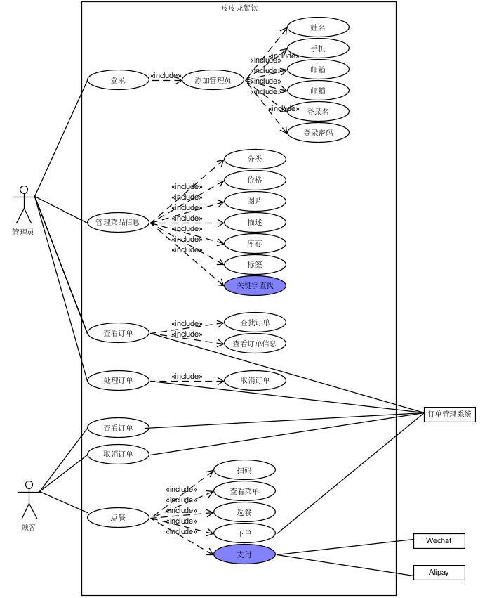

# 用例图
{:.no_toc}

* 目录
{:toc}

#### 整个系统的用例图如下：

## 用例文本
* 整个系统的用例如下，可根据需要查看各子用例图。
#### **基本用例：**
商家：
* [注册登录](注册登录.md)：餐厅管理员可通过此用例注册和登录系统
* [管理菜品信息](管理菜品信息.md)：管理员可以对菜品信息进行管理，管理的内容包括：分类、价格、图片、描述、标签、菜品排序
* [查看订单](管理员查看订单.md): 管理员可以查询已有订单，并能查看订单的详细信息
* [处理订单](管理员处理订单.md)：管理员可对现有订单进行确认和拒绝

顾客：
* [点餐](顾客点餐.md)：顾客在到达餐厅后，可扫描餐桌上的二维码进入本小程序，根据菜单选择菜品，并支付下单
* [查看订单](顾客查看订单.md)：顾客可以查看已下的订单
* [取消订单](顾客取消订单.md)：如果顾客对订单不满意，可对订单进行取消。

#### **扩展用例**
* 催单：在半个小时内没有上菜则可以进行催单
